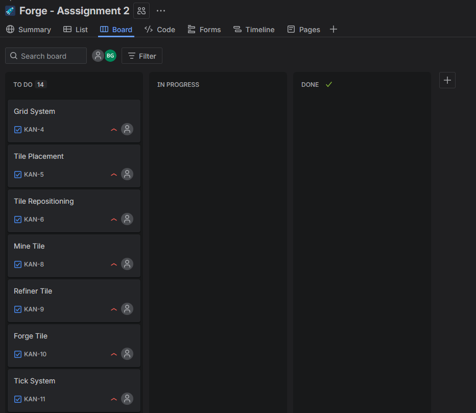
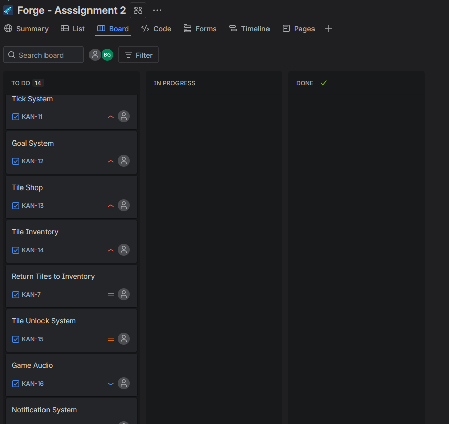
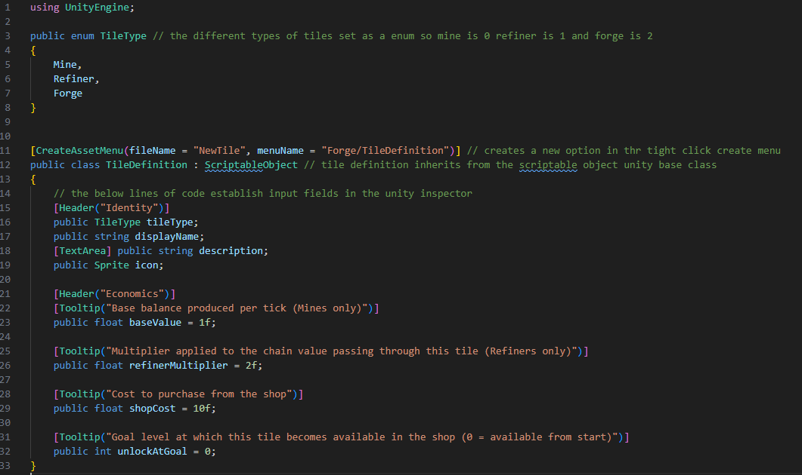
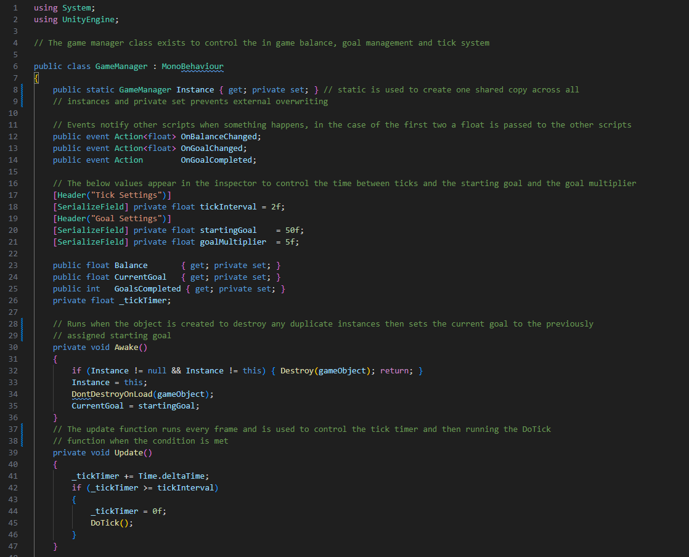
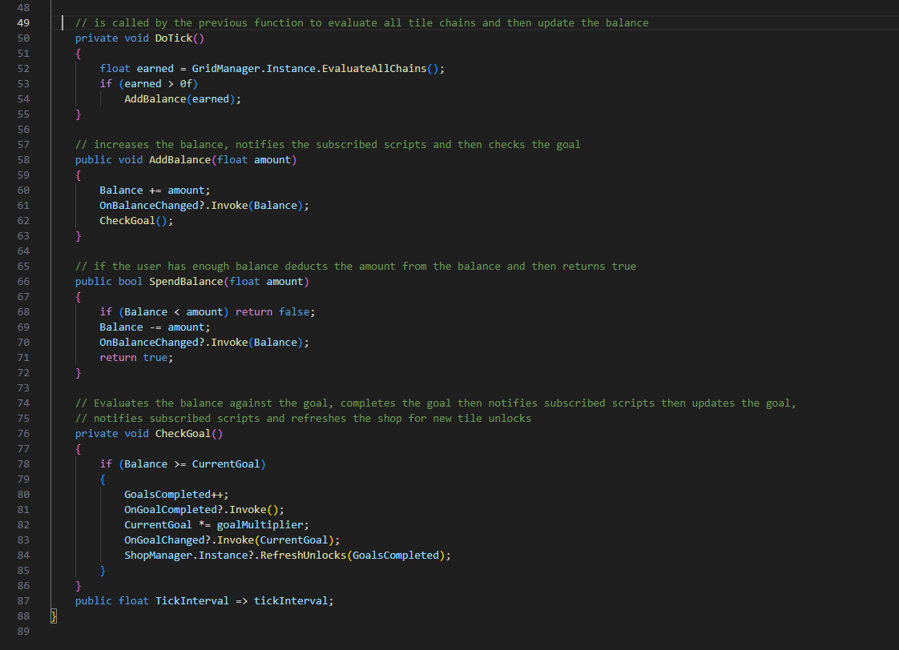

# Software Development 2 Assignment 2: Forge Factory Game

## 1.0 User Stories 

High priority:
* The player should be able to drag tiles that lock to the game grid

* The player should be able to generate balance per in game tick when a forge tile is connected to a mine tile

* The player should be able to place refiners inbetween a mine and a forge tile to multiply the balance value generated per in game tick

* The player should be able to read the current balance from the top of the screen and it should update with each in game tick

* The player should be able to purchase tiles from the shop window that will then appear in the inventory window

* The player should be able to complete goals of incremental difficulty to progress through the game 

Medium Priority:
* The player should be able to adjust the position of tiles after they have been placed

* The player should unlock new types of tiles as they progress through the game

* The player should be able to drag tiles off of the grid, when this happens the tiles should return to the inventory

Low Priority:
* The player should be get audio feedback when performing actions in the game

* The player should receive notifications when a goal is completed
## 2.0 System Requirements

Functional Requirements 

* The game will take place on a eight by eight grid

* Tiles can be placed in unoccupied grid cells

* A tick mechanism will be utilised to update the balance value

* Every tick, tile chains will evaluate tile chains placed on the grid

* The value of tile chains will be calculated by multiplying the mines base value by the value of the refiners 

* Every tick the system will check if the goal has been met

* The goal is multiplied incrementally after it has been met

Non-Functional Requirements

* The user will control the game using a computer mouse

* The game will be utilise the unity game engine

* The game will be responsive and any changes to the gameplay grid will be implemented before the next tick
## 3.0 Scrum Backlog 

Above is the complete scrum backlog for this project. In this section, backlog tasks will be expanded upon and assigned a priority level

### High Priority:
#### Grid System 
An eight by eight grid should be generated when the scene loads, each grid cell should be able to be accessed via its grid co-ordinates

#### Tile Placement
Tiles should be able to be dragged from the inventory onto the grid, the tile should snap into position if over an empty cell. If the cell is not empty, the tile should return to the inventory.

#### Tile Repositioning 
Already placed cells should be able to be dragged from one cell to another. If a tile is dragged off of the grid it is returned to the inventory.

#### Mine Tile
Mine tiles act as the starting point of tile chains and are assigned a base value that is multiplied upon by refiner tiles every tick

#### Refiner Tile
When placed in a chain refiner tiles adjust the value of the chain by a fixed multiplier  

#### Forge Tile
Forge tiles are the endpoints of tile chains and update the balance every tick by the value of the tile chain

#### Tick System
The tick system exists as a fixed interval that is used as to determine frequency of balance updates 

#### Goal System 
Goals act as a numerical target for players to meet that is then incrementally increased after each goal has been achieved 

#### Tile Shop
The shop allows the player to purchase new tiles, when tiles are purchased they are added to the inventory 

#### Tile Inventory 
Records and displays tiles bought by the player

### Medium Priority:
#### Return Tiles to Inventory
Tiles that have been dragged off of the grid or have been placed in an invalid location are returned back to the grid

#### Tile Unlock System
Certain tiles will be unlocked to buy from the shop when certain goals are met

### Low Priority 
#### Game Audio
When tiles are placed, bought or sold appropriate sound queues should be played

#### Notification System
When Goals are met a notification should be sent to the users informing them that they have met the current goal

## 4.0 Design Breakdown

## 5.0 Functional Breakdown
### 5.1 TileDefinition.cs

The Tile Definition script is a Unity Scriptable Object this acts as a template for all the different tile types utilised in Forge and could be expanded on in future to add more tile types. The script consists of two main sections the enumeration used to identify the type of tile and the class declaration that creates a range of variables that can be interacted with in the unity inspector. Both the unity documentation(Unity Technologies, 2024a) and gamedevbeginner(French, 2024a) tutorial helped greatly when developing this script.

### 5.2 GameManager.cs

The Game Manager script acts as the control hub of the game. It manages the tick system, the goal system and the in game balance. As well as informing other scripts of changes to the balance and when the goal as been met. The game manager follows the Singleton design pattern this ensures that only one instance of the GameManager class exists at a time. The development of this class was greatly assisted by both a gamedevbeginner(French, 2024b) article and a Medium(Erol, 2022) article.
### 5.3 GridManager.cs
### 5.4 AudioManager.cs
### 5.5 GridCell.cs
### 5.6 DragHandler.cs
### 5.7 InventorySlot.cs
### 5.8 InventoryManager.cs
### 5.9 ShopSlot.cs
### 5.10 ShopManager.cs
### 5.11 UIManager.cs
### 5.12 NotificationManager.cs
### 5.13 CreateTileSprites.cs

## 6.0 Project Management
 
## 7.0 Coding Techniques and Software Tools

## 8.0 Testing

## 9.0 References