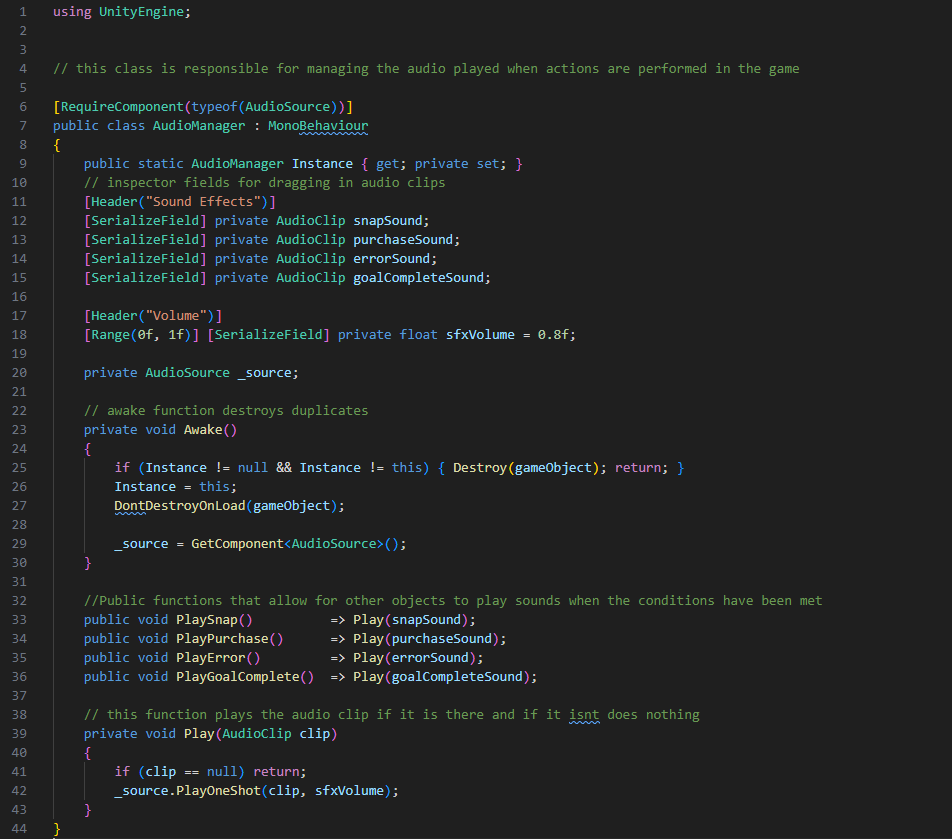
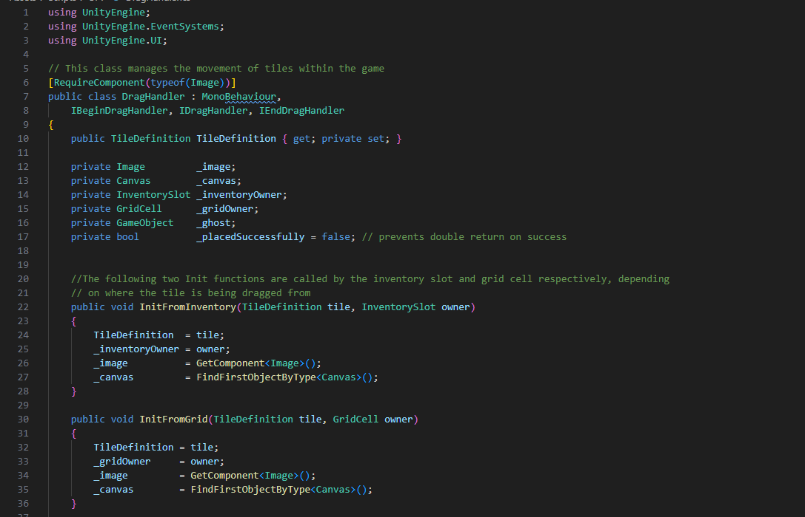
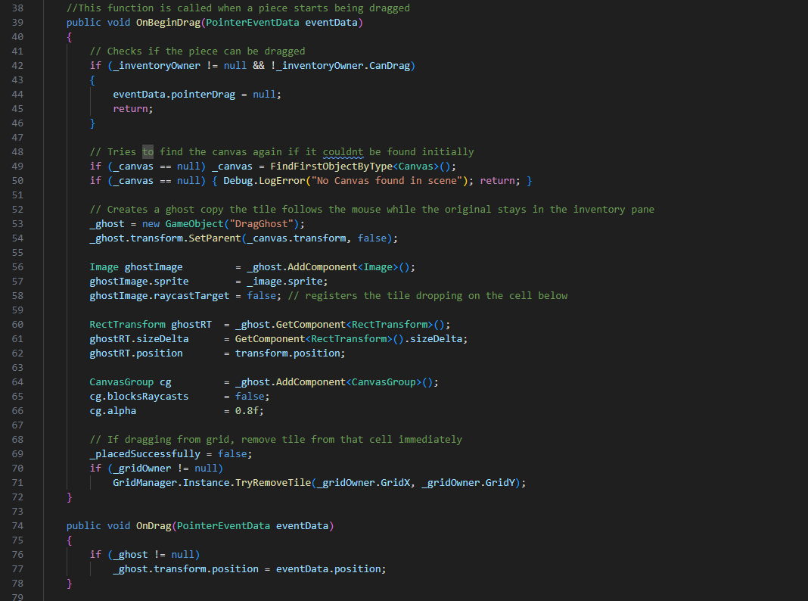
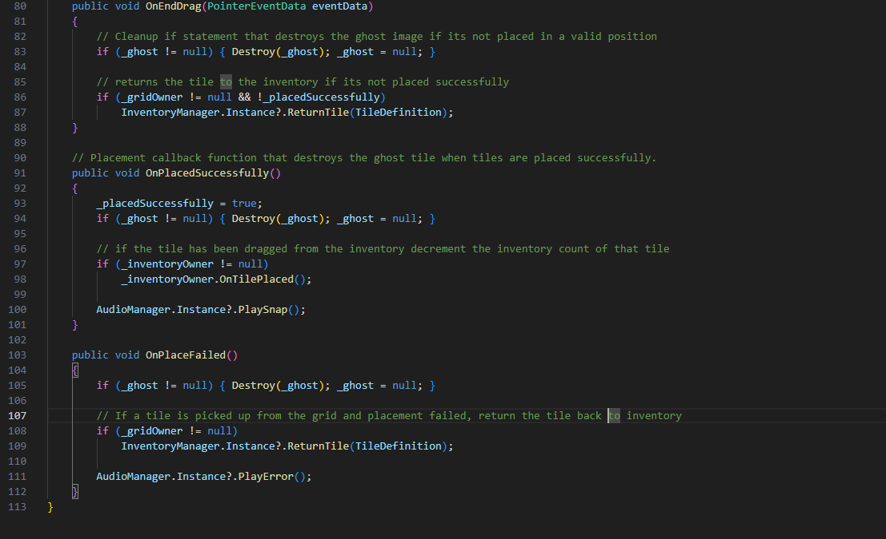
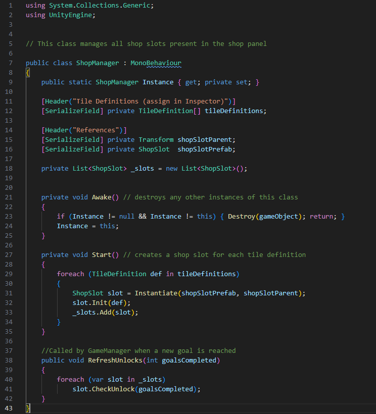
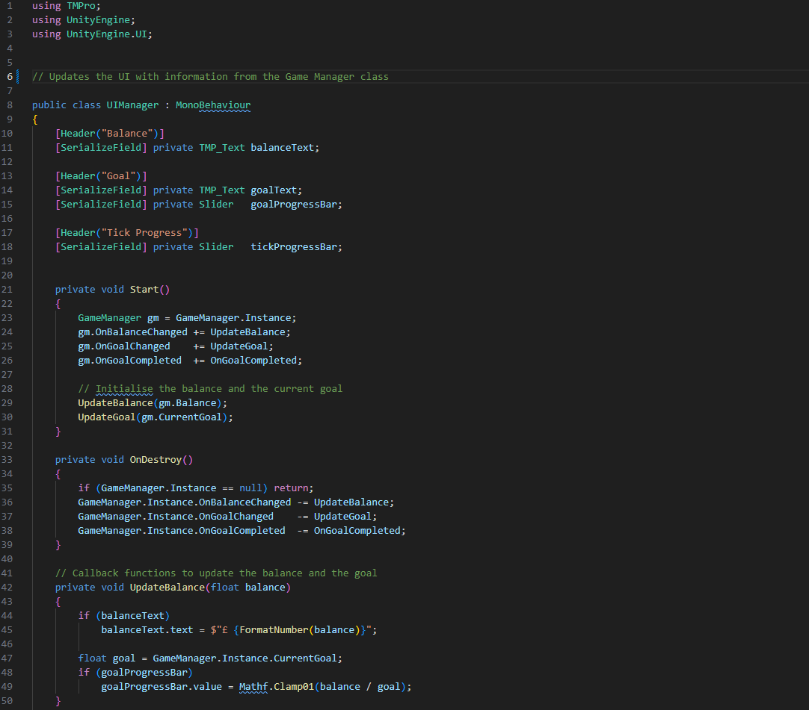
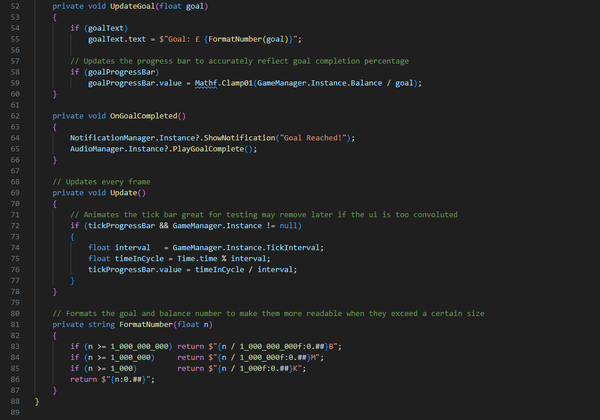
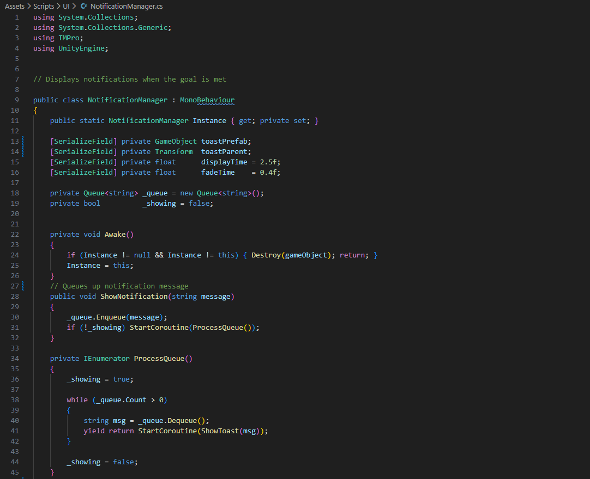
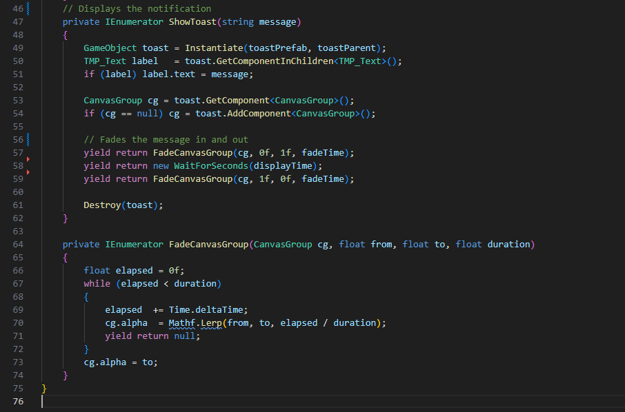

# Software Development 2 Assignment 2: Forge Factory Game

## 1.0 User Stories 

High priority:
* The player should be able to drag tiles that lock to the game grid

* The player should be able to generate balance per in game tick when a forge tile is connected to a mine tile

* The player should be able to place refiners inbetween a mine and a forge tile to multiply the balance value generated per in game tick

* The player should be able to read the current balance from the top of the screen and it should update with each in game tick

* The player should be able to purchase tiles from the shop window that will then appear in the inventory window

* The player should be able to complete goals of incremental difficulty to progress through the game 

Medium Priority:
* The player should be able to adjust the position of tiles after they have been placed

* The player should unlock new types of tiles as they progress through the game

* The player should be able to drag tiles off of the grid, when this happens the tiles should return to the inventory

Low Priority:
* The player should be get audio feedback when performing actions in the game

* The player should receive notifications when a goal is completed
## 2.0 System Requirements

Functional Requirements 

* The game will take place on a eight by eight grid

* Tiles can be placed in unoccupied grid cells

* A tick mechanism will be utilised to update the balance value

* Every tick, tile chains will evaluate tile chains placed on the grid

* The value of tile chains will be calculated by multiplying the mines base value by the value of the refiners 

* Every tick the system will check if the goal has been met

* The goal is multiplied incrementally after it has been met

Non-Functional Requirements

* The user will control the game using a computer mouse

* The game will be utilise the unity game engine

* The game will be responsive and any changes to the gameplay grid will be implemented before the next tick
## 3.0 Scrum Backlog 

Above is the complete scrum backlog for this project. In this section, backlog tasks will be expanded upon and assigned a priority level

### High Priority:
#### Grid System 
An eight by eight grid should be generated when the scene loads, each grid cell should be able to be accessed via its grid co-ordinates

#### Tile Placement
Tiles should be able to be dragged from the inventory onto the grid, the tile should snap into position if over an empty cell. If the cell is not empty, the tile should return to the inventory.

#### Tile Repositioning 
Already placed cells should be able to be dragged from one cell to another. If a tile is dragged off of the grid it is returned to the inventory.

#### Mine Tile
Mine tiles act as the starting point of tile chains and are assigned a base value that is multiplied upon by refiner tiles every tick

#### Refiner Tile
When placed in a chain refiner tiles adjust the value of the chain by a fixed multiplier  

#### Forge Tile
Forge tiles are the endpoints of tile chains and update the balance every tick by the value of the tile chain

#### Tick System
The tick system exists as a fixed interval that is used as to determine frequency of balance updates 

#### Goal System 
Goals act as a numerical target for players to meet that is then incrementally increased after each goal has been achieved 

#### Tile Shop
The shop allows the player to purchase new tiles, when tiles are purchased they are added to the inventory 

#### Tile Inventory 
Records and displays tiles bought by the player

### Medium Priority:
#### Return Tiles to Inventory
Tiles that have been dragged off of the grid or have been placed in an invalid location are returned back to the grid

#### Tile Unlock System
Certain tiles will be unlocked to buy from the shop when certain goals are met

### Low Priority 
#### Game Audio
When tiles are placed, bought or sold appropriate sound queues should be played

#### Notification System
When Goals are met a notification should be sent to the users informing them that they have met the current goal

## 4.0 Design Documentation
Forge is a simple 2D factory builder game that takes place on a grid. Gameplay consists of making chains of tiles on the grid that start with a mine tile and end with a forge tile. Refiner tiles can be placed in the middle section of the chain to further multiply the balance generated. The main gameplay loop consists of the player making tile chains to generate balance to meet a goal. When a goal is met, it is multiplied therefore increasing difficulty and forcing the player to redesign their tile based factory.

Forge will be developed using unity 6.3, the game will be playable on windows and distributed via Steam/Epic Games. To play Forge the player only needs a mouse as all gameplay functions are click based. Keyboard shortcuts may be added later. The Target Audience of Forge are people who enjoy factory and idle games, as the core gameplay loop is very reminiscent of other factory games but heavily simplified. This makes Forge a great entry level game for players looking to get into the factory game genre.

### 4.1 Game Rules:
* The game takes place on a square grid
* Each grid cell can only hold one tile
* Tiles can only be placed in empty cells
* Balance is generated by chains of tiles
* A chain is a straight line of tiles (not diagonal) that starts with a Mine and ends with a Forge
* Refiners are used to fill out chains and multiply their value
* A Forge can only be used in one chain at a time
* Balance can be used to buy new tiles
* Balance also used to meet goals
* When a goal is met the next goal is 5x the previous goal

### 4.2 Motivation Loop:
Player State:
The player builds a factory composed of chains of tiles that generate balance every in game tick.
Need:
The player is working to build up enough balance to meet the current goal.
Reward: 
When the goal is met new tiles will be unlocked in the shop for the player to buy, in future this may also include upgrades to pre-existing tiles.
Challenge:
The main challenge of forge is the player being able to meet the goal as when the goal is met it is updated to require five times as much balance. 

### 4.3 Gameplay Loop:
The main gameplay loop of forge can be summarised by the below state diagram:

### 4.4 UI Breakdown:

Above is a low fidelity design of the games user interface

Above is a high fidelity design of the games user interface

As can be seen from both the above designs, Forges user interface is quite simple but that is one of its main strengths as this is what allows anybody to play the game. The most prominent feature of the design is the gameplay grid as this is where most of the game takes place as both the outer panels are just menus.

## 5.0 Development Breakdown
### 5.1 TileDefinition.cs

The Tile Definition script is a Unity Scriptable Object this acts as a template for all the different tile types utilised in Forge and could be expanded on in future to add more tile types. The script consists of two main sections the enumeration used to identify the type of tile and the class declaration that creates a range of variables that can be interacted with in the unity inspector. Both the unity documentation(Unity Technologies, 2024a) and gamedevbeginner(French, 2024a) tutorial helped greatly when developing this script.

### 5.2 GameManager.cs

The Game Manager script acts as the control hub of the game. It manages the tick system, the goal system and the in game balance. As well as informing other scripts of changes to the balance and when the goal as been met. The game manager follows the Singleton design pattern this ensures that only one instance of the GameManager class exists at a time. The development of this class was greatly assisted by both a gamedevbeginner(French, 2024b) article and a Medium(Erol, 2022) article.
### 5.3 GridManager.cs

The Grid Manager script is the most complex script in the game it creates the grid both logically and visually. Manages tile placement and removal, as well as calculating the value of chains of tiles utilising a breadth first search. To create this search this geeks for geeks article was used (geeksforgeeks, 2023).
### 5.4 AudioManager.cs

The Audio Manager class is used to create unity inspector fields for audio clips to be dragged into and also to facilitate the sound files being played when necessary by creating public functions to play the audio files. To create this class both the unity documentation (Unity Technologies, 2025a) and this gamedevbeginner (French, 2024c) article were used.
### 5.5 GridCell.cs

The Grid Cell class is attached to every cell in the eight by eight game grid and is used to manage tile placement and removal as well as interfacing with the DragHandler script to allow tiles to be moved by the player. To help implement the placement feature a Medium article about drag and drop inventories was used (Duggan, 2024).
### 5.6 DragHandler.cs

The Drag Handler class allows for the user to drag tiles from the inventory to the game board and allows for tile to be dragged from one cell on the board to another. It does this by creating a ghost copy of the tile and then deleting the copy when the tile is placed 
### 5.7 InventorySlot.cs

The Inventory Slot class represents one inventory slot in the players inventory and is responsible for adding and subtracting from the total of the tile in the slot and refreshing the UI when any action involving the slot has taken place.
### 5.8 InventoryManager.cs

The Inventory Manager class manages the inventory as a whole, it assigns new tiles to an inventory slot when purchased, creates slots when a tile is purchased that is the first of its kind and decrements the tile count when a tile is placed.
### 5.9 ShopSlot.cs

The Shop Slot class manages an individual slot in the shop panel. It is used to determine whether a user has unlocked a specific tile yet and allows them to purchase tiles and send them to the inventory.
### 5.10 ShopManager.cs

The Shop Manager class is utilised to create a shop slot for every tile definition.
### 5.11 UIManager.cs

The UI Manager class subscribes to the events from the Game Manager class and update the user interface accordingly. The advantage of this is rather than updating the UI every frame using an Update function the ui is only updated when the relevant variables change.
### 5.12 NotificationManager.cs

The Notification Manager Class queues up and displays toast notifications before destroying them, this was accomplished using coroutines. When developing this class both the Unity documentation on coroutines (Unity Technologies, 2024b) and the unity learn tutorial were particularly helpful (Unity Learn, 2026).

## 6.0 Project Management
### 6.1 Meeting Logs
Below are logs from the four meetings that were conducted throughout the project, all four are dated and aim to answer the prerequisite questions of, what has been accomplished since the last, what will be accomplished by the next meeting and any potential problems that may arise.

### 6.2 Burndown Chart

## 7.0 Coding Techniques and Software Tools
### 7.1 Tools Used
* Unity 6.3 - Unity was used as the game engine of choice for this project due to previous experience using the game engine
* VS Code - VS Code was used in conjunction with unity as the IDE for all C# scripts used
* Git - Git has been utilised to maintain version control
* Github - github has been used to host a remote repository 
* TextMeshPro - used to render text in game
* Unity UI - used to create a canvas based user interface

### 7.2 Coding Techniques
Scriptable objects
Scriptable objects were utilised in Forge to add a layer of separation between data and behavior. This can be observed in the different tile types. All tiles use the same Tile definition script but differ in the Unity inspector window.

Singleton Pattern
The Singleton Pattern is used throughout Forges scripts and is found in any class with Manager in the title. This allows for an easier time when accessing information in other classes as it prevents the need for a lot of object references.

Breadth First Search
A breadth first search is utilised in the evaluate all chains function in the grid manager class to interpret tile chains.

C# Events
C# Events were used to communicate between the GameManager class and the UIManager Class to update the UI in accordance with information from the Game Manager class.

Coroutines 
Used to allow toast notifications to fade in and out.

Prefabs 
GridCells, ShopSlots and InventorySlots are all created as prefabs that are created in runtime rather than prior to when they are needed this allows for advanced scalability. For example grid size can be increased easily, in the inspector, without having to change any code.
## 8.0 Testing
### 8.1 Testing Table

### 8.2 Requirement Analysis 
Below is a table that analyses whether Forge has met the previously outlined requirements.
| Requirement | Met? | Evidence |
|------------|------|----------|
| The player should be able to drag tiles that lock to the game grid | Yes | T02 |
| The player should be able to generate balance per in game tick when a forge tile is connected to a mine tile | Yes | T04 |
| The player should be able to place refiners between a mine and a forge tile to multiply the balance value generated per in game tick | Yes | T05, T06 |
| The player should be able to read the current balance from the top of the screen and it should update with each in game tick | Yes | T16 |
| The player should be able to purchase tiles from the shop window that will then appear in the inventory window | Yes | T12 |
| The player should be able to complete goals of incremental difficulty to progress through the game | Yes | T07 |
| The player should be able to adjust the position of tiles after they have been placed | Yes | T09 |
| The player should unlock new types of tiles as they progress through the game | Yes | T14 |
| The player should be able to drag tiles off of the grid and they should return to the inventory | Yes | T10 |
| The player should get audio feedback when performing actions in the game | Partial | Audio system implemented, clips not assigned |
| The player should receive notifications when a goal is completed | Yes | T15 |
| The game will take place on an eight by eight grid | Yes | T01 |
| Tiles can be placed in unoccupied grid cells | Yes | T02, T03 |
| A tick mechanism will be utilised to update the balance value | Yes | T04 |
| Every tick, the system will evaluate tile chains placed on the grid | Yes | T04, T05, T06 |
| The value of tile chains will be calculated by multiplying the mines base value by the value of the refiners | Yes | T05, T06 |
| Every tick the system will check if the goal has been met | Yes | T07 |
| The goal is multiplied incrementally after it has been met | Yes | T07 |
| The user will control the game using a computer mouse | Yes | All tests |
| The game will utilise the Unity game engine | Yes | All tests |
| The game will be responsive and any changes to the gameplay grid will be implemented before the next tick | Yes | T02, T09 |

## References
Duggan, S. (2024) Unity UI — Drag and Drop Inventory System, Medium. Available at: https://medium.com/@sean.duggan/unity-ui-drag-and-drop-inventory-system-ae84d1173d3e (Accessed: 17 March 2026).
Erol, I.U. (2022) Implementing the Singleton Design Pattern in Unity with C#, Medium. Available at: https://medium.com/@tzdevil/using-the-singleton-design-pattern-in-unity-c-226bf8aa5304 (Accessed: 17 March 2026).
French, J. (2024a) Scriptable Objects in Unity, Game Dev Beginner. Available at: https://gamedevbeginner.com/scriptable-objects-in-unity/ (Accessed: 17 March 2026).
French, J. (2024b) Singletons in Unity (done right), Game Dev Beginner. Available at: https://gamedevbeginner.com/singletons-in-unity-the-right-way/ (Accessed: 17 March 2026).
French, J. (2024c) How to play audio in Unity (with examples), Game Dev Beginner. Available at: https://gamedevbeginner.com/how-to-play-audio-in-unity-with-examples/ (Accessed: 17 March 2026).
GeeksforGeeks (2023) Breadth First Search or BFS for a Graph. Available at: https://www.geeksforgeeks.org/dsa/breadth-first-search-or-bfs-for-a-graph/ (Accessed: 17 March 2026).
Unity Learn (2026) Coroutines, Unity Technologies. Available at: https://learn.unity.com/tutorial/coroutines (Accessed: 17 March 2026).
Unity Technologies (2024a) Introduction to ScriptableObjects, Unity Learn. Available at: https://learn.unity.com/tutorial/introduction-to-scriptable-objects (Accessed: 17 March 2026).
Unity Technologies (2024b) Write and run coroutines, Unity Manual. Available at: https://docs.unity3d.com/Manual/Coroutines.html (Accessed: 17 March 2026).
Unity Technologies (2025a) AudioSource.PlayOneShot, Unity Scripting API. Available at: https://docs.unity3d.com/ScriptReference/AudioSource.PlayOneShot.html (Accessed: 17 March 2026).