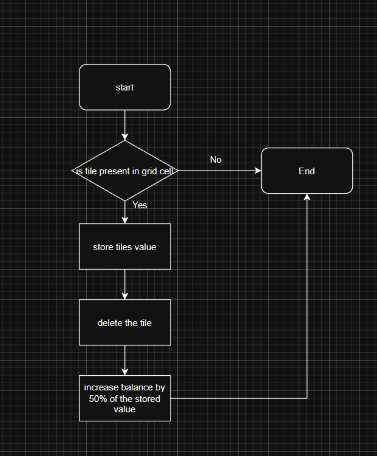
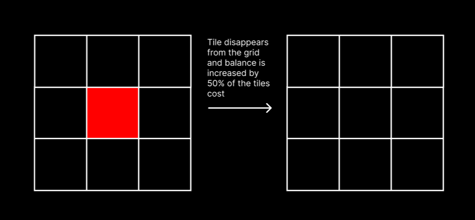
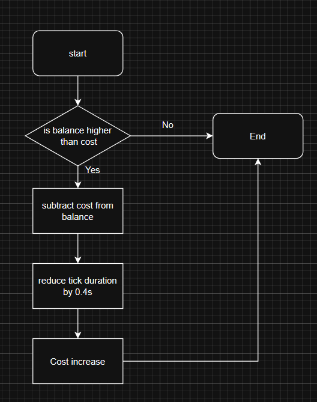
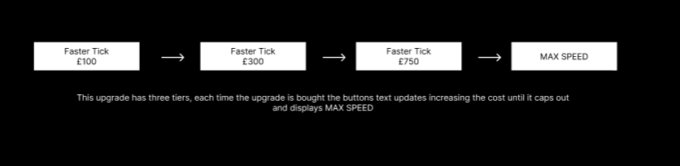
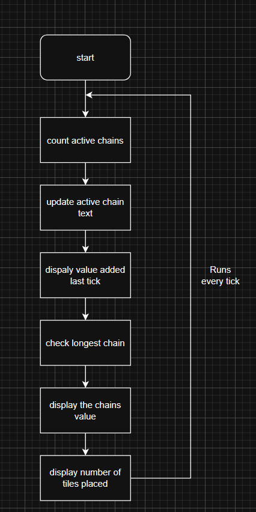
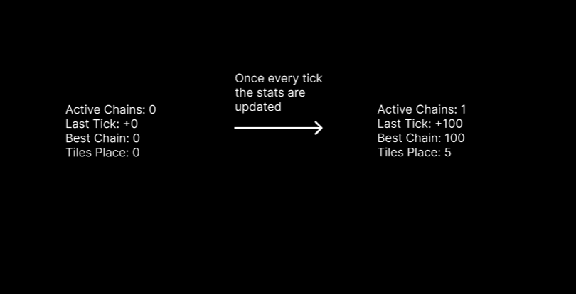
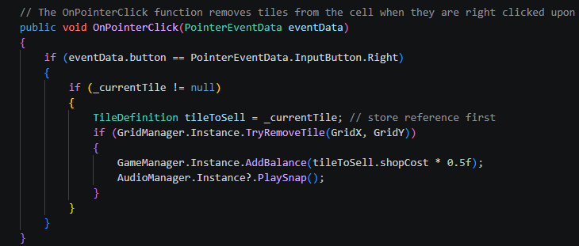

# Software Development 2 Assignment 3: Forge Factory Game

## Scrum Backlog for New Features

### Tile Sell System
Players will be able to right click any tile placed on the grid to sell it for 50% of its cost. When this occurs the tile is deleted from the grid area and the balance updates.

Success Criteria:
* Right clicking a placed tile deletes it from the grid and updates the balance by adding 50% of its cost 
* Right clicking an empty cell has no adverse effects
* Chains are re-evaluated after tile deletion

Tests:
* T1: Right-click a placed Mine tile and ensure it is removed from the grid
* T2: Verify the balance increases by exactly 50% of the tiles shop cost after selling
* T3: Right-click an empty cell and make sure nothing happens
* T4: Place a Mine-Forge chain, sell the Forge tile, verify balance stops generating

### Tick Speed Upgrade
A purchasable upgrade available in the shop panel that reduces the tick interval. 
Three tiers available costing 100, 300 and 750 balance. Minimum tick interval is 0.75 seconds.

Success Criteria:
* Button visible in shop panel displaying correct tier cost
* Button only clickable when balance is sufficient
* Each purchase reduces tick interval by 0.4 seconds
* Button displays MAX SPEED and disables after third upgrade

Tests:
* T5: Verify the upgrade button is greyed out when balance is below 100
* T6: Purchase the first upgrade and verify the tick interval decreases
* T7: Purchase all three upgrades and verify the button displays MAX SPEED

### Stats Panel
A panel displaying active chains, balance earned last tick, best chain value and total tiles placed. Updates every tick.

Success Criteria:
* Panel visible during gameplay
* All four statistics display correct values
* Values update after every tick

Tests:
* T8: Place one Mine-Forge chain and verify Active Chains displays 1
* T9: Verify Last Tick value matches the balance increase after a tick
* T10: Place two chains of different values and verify Best Chain shows the higher value
* T11: Place three tiles and verify Tiles Placed displays 3

## Design of new features
### Design of Sell Feature
Below are both the visual design and flowchart of the sell functionality. Before the sell system was implemented the player could remove tiles from the grid and return to the inventory. This worked well but allowed the player to be very unintentional with tile placement. Now the user cannot return tiles to the inventory they can only move them on the game board or sell them. This change aims to increase the difficulty of the game.

### Design of Tick Speed Upgrade
Below are both the visual design and flowchart of the tick upgrade system. The objective of the tick upgrade system is to allow the user to speed up the gameplay loop while adding another avenue for progression. 

### Design of the Stats Panel
The stats panel allows the user to view information about the current game state. It adds a layer of transparency, that allows the player to better understand how their current tile setup is performing. While the stats pane itself doesn't add anything to the gameplay loop, its addition should make the game easier for new players and give experienced players a satisfying level of clarity. Below are the flow diagram and visual design of this feature. 

## Implementation of new features
### Implementation of Sell Feature
The implementation of the sell feature was relatively simple as a lot of the infrastructure was already in place from the previous return to inventory system. 

As can be seen in the above image this is the adjusted function. It now stores a reference to the tile before deleting it and adding to the balance.
### Implementation of Tick Speed Upgrade Feature
### Implementation of Stats Panel Feature
